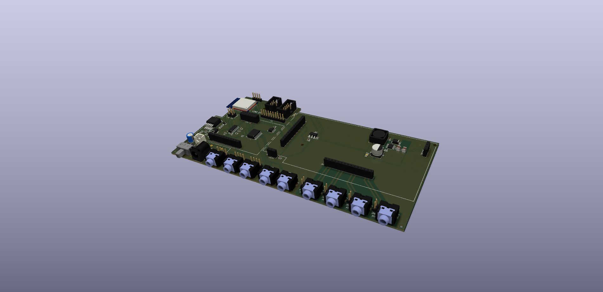

# SW22 - A modular E-Stim

---

*This project is a work in-progress. Changes to the design might occur. Order PCBs at your own risk..*

---

## About
The SW22 is a modular E-Stim box based on the [ZC95](https://github.com/CrashOverride85/zc95) and the [WT-312](https://github.com/WendyTeslaburger/WT-312). 
It has a similar form factor and output design to the MK312-BT (which in turn is a clone of the ET-312B).

An <abbr title="ESP32-WROOM-32">ESP32</abbr> module is used for high level control (front panel controls, display, Bluetooth audio, etc) of the device, while an RP2040 microcontroller (RPi Pico) is used as a co-processor for pulse/routine generation (taking advantage of [PIO](https://raspberrypi.github.io/pico-sdk-doxygen/group__hardware__pio.html#details)). The firmware is open source and written in C.

Compared to the MK312-BT, it has two extra output channels, four auxiliary inputs, and four triggers. 

## Features
* Bluetooth A2DP*
* RS232 front panel serial
* 2x TRS 3.5mm Aux channels with expansion board support (e.g. Stereo Audio + Mono Microphone, RS232 Remote)
* 2x TRS 3.5mm Trigger channels
* Tri polar (+, GND, -) output channel support
* Modular output drivers per channel (Think: Sparkfun, Adafruit, etc.) incl. modular driver board.
* Individual channel sensing via quad 12-bit ADC
* 1.8" Color TFT display
* Support for an internal 0.96" I2C OLED display (e.g. debugging/testing)
* 256kb EEPROM for configuration
* Battery voltage monitoring
* Charge sense (Barrel jack voltage monitoring)

## Overview
The SW22 consists of following PCBs:
* Front Panel Cover - No traces, just the cosmetic front panel with text. Could be 3D printed or laser cut.
* Front Panel - I2C based expansion board with 4x POTs with associated ADC, 1x rotary encoder, 4x tactile buttons, 1x buzzer, and 8x addressable RGB LEDs.
* Base Board - Provides system power, battery charging, expansion, Bluetooth, front panel interface, and general control.
* Driver Board - Provides low-level control over channel output modules.
* Output Modules - Generates the E-Stim for each channel. A module per channel, controlled by the driver board. 
* Expansion Module (Optional) - Allows advanced configuration of Aux channels (e.g. Audio+Microphone)

The main reason for having modular PCBs is for flexibility and long term cost saving. Most of the cost and time that is involved in the project is the firmware, case, display, controls, etc. So being able to reuse parts when changing the design (e.g. new output modules, driver board, etc) should help keep time and cost down.

Additionally, the SW22 was designed with the front panel and display being optional accessories. Anything that can be achieved on the front panel, can be done via Bluetooth/WiFi. The driver board can be used as a standalone module (Think: Sparkfun, Adafruit, etc.).

## Build Notes
The majority of this build is SMT. I have tried to keep parts large enough (0603 and above) for manual pick and place. However, for a few components, no alternative was available (e.g. Driver board uses MSOP/VSSOP packages).

Most SMD components used are available from Mouser and LCSC. Front panel components being mostly available at places that aren't LCSC (pots, encoders, audio jacks, etc).

Some components have a thermal pad that will require a reflow oven or using hot air reflow soldering.

## [Schematics](schematics/)

## [Gerbers](gerbers/)
Gerbers are created for use with JLCPCB. P&P POS files untested/missing (since I assemble the PCBs myself).

## Firmware
The firmware is open source and written in C. You can find the source code in the [swef](https://github.com/saawsm/swef) and [swx](https://github.com/saawsm/swx) repositories.  Precompiled firmware for the SW22 can be found in the [releases](https://github.com/saawsm/SW22/releases) (for the absolute latest firmware, compile it from source).  
