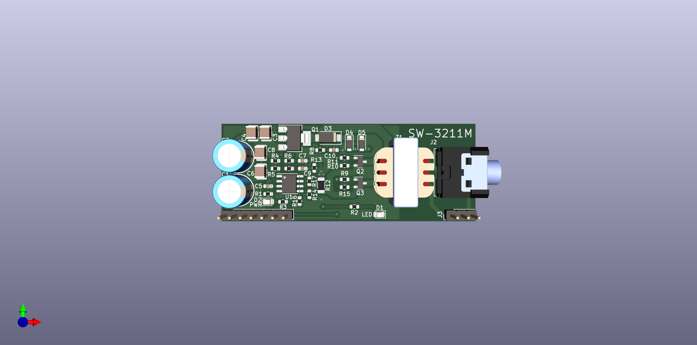

# SW-3211M, a MK-312 style driver on a stick!

## About
This board aims to bring the hardware of e-stim/EMS/TENS to an easy-to-use module. Think: Sparkfun, Adafruit, etc.

This device tries to mimic the output stage of the well-known Erostec ET312 or better, the DIY reverse engineered MK-312.
Hopefully by recreating this output stage, the same e-stim experience can be achieved as those devices.

Its been designed with the ESP-32 microcontroller in mind (hence SW-32), but should work with others. 

The original design of this module was based on the design by [WendyTeslaburger/WT-312](https://github.com/WendyTeslaburger/WT-312).

## Status
- [x] Create v1.0 Schematic
- [x] Route v1.0 PCB
- [x] Order v1.0 PCBs
- [ ] Review process
- [ ] Add alternative BOM sources

## Theory of operation
### Output stage:

Just like the ET/MT312 this stick uses a 42TL004 audio transformer with the primary connected to the TENS output and the secondary connected to some circuitry to generate pulses.

These pulses are generated by the microcontroller, it can control frequency (how many pulses per second) and the duration of each pulse.

A single "pulse"  consists of two steps:
1. Apply a voltage on `PULSE_A`. This will make one of both N-FETs conductive and current will start to flow through half the windings of the transformer.
2. Apply a voltage on `PULSE_B`. This will make current flow through the other half of the transformer and reverse the polarity of the output TENS signal. Thus making this a bi-polar TENS driver.

To prevent the an excessive high drain-source voltage on the N-MOS drivers because of back-EMF generated by the transformer, two diodes will clamp this voltage to a zener diode on top of the centre-tap voltage.

### Level/current control

The intensity of a TENS stimulus is not only defined by the duration and frequency of the pulses, but also by the output power of that pulse. To control the output power of a pulse, we can limit how much current is flowing into the primary side of the transformer.

By controlling the gate-voltage of a P-FET it is possible to control how much current that P-FET will allow to flow. An opamp is used to boost the I/O-voltage of the microcontroller to the 9V needed on the P-FET gate.

Important to note is that the `I_LIMIT` signal is inverted, a 0V means the P-FET is allowing maximal current and a >3.3V will mean the P-FET is turned off.

### Current feedback

Because not all P-FETs are created 100% equally, it is important to first characterize the feedback curve between the `I_LIMIT` signal and the current flowing through the transformer. This curve can be measured by the MCU on a embedded or external ADC on the `I_SENSE` pin of the SW-3211M module.

To keep the voltage lost over the shunt resistor to a minimum, a small value shunt resistor is used and then amplified to the full-range of the ADC by an opamp.