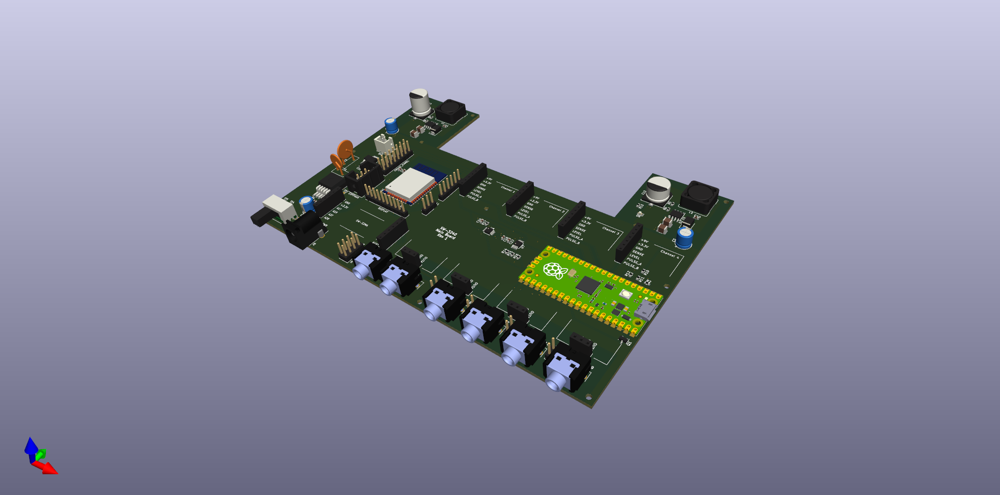

# SW-3240 - Main Board

## About
This is a main board of SW-3240. It supports a max of 4 output channels.
It provides power (+3.3V, +5V, and +9V), battery charging, and low-level control of the output modules.

## Status
- [ ] Create v1.0 Schematic
- [ ] Route v1.0 PCB
- [ ] Order v1.0 PCBs
- [ ] Review 

## Gerber & Bill of Materials (BOM)
The Gerber zip file was generated with [JLCPCB](https://jlcpcb.com/) in mind (excluding assembly).
Two BOM sources are available, the interactive HTML BOM located in `/bom` folder, and a CSV file.
